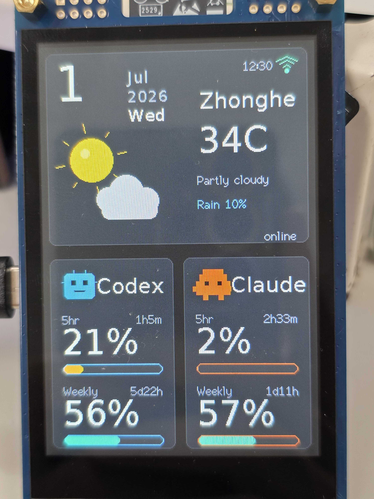
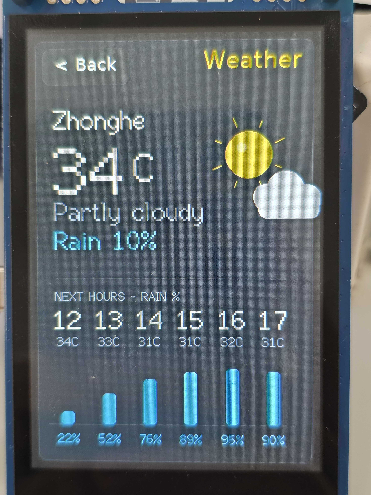
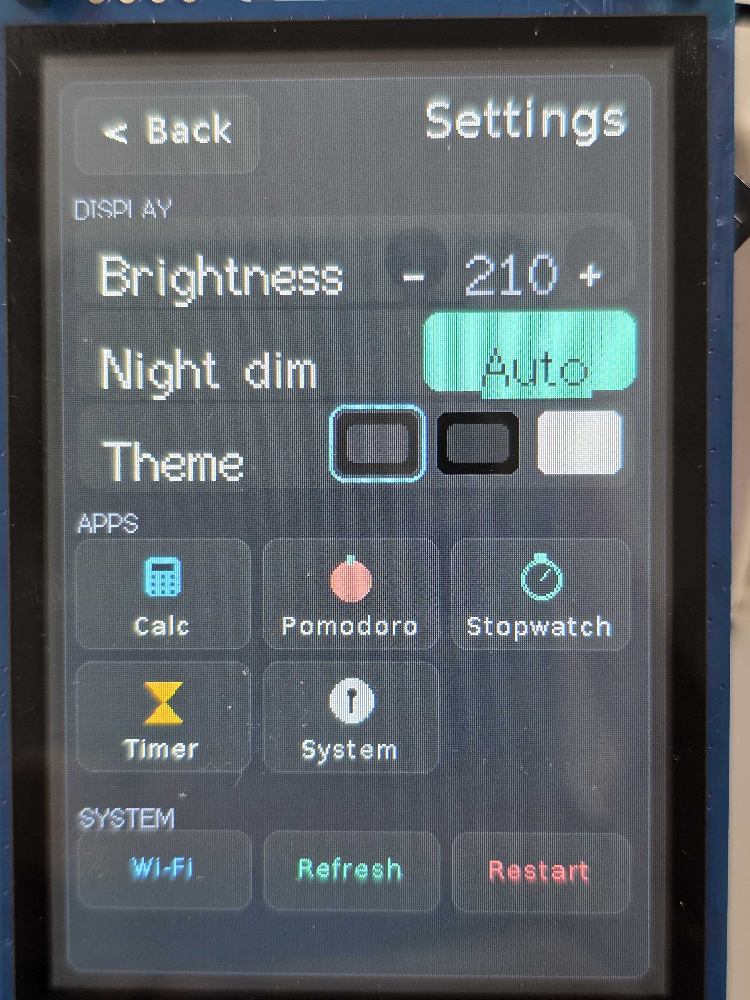

# ESP32-S3 AI Usage Weather Dashboard

[English](README.md) | [繁體中文](README.zh-TW.md)

Small dashboard firmware for a 3.5-inch ESP32-S3 N16R8 capacitive touch display. It shows:

- weather icon, city, temperature, and rain chance
- a live NTP clock (top-right of the weather panel)
- Claude 5hr and weekly remaining quota
- Codex 5hr and weekly remaining quota

The firmware is a display/client. If Wi-Fi or an API URL is not configured, it runs in offline demo mode.

Runtime behaviors:

- **Flicker-free rendering** — the whole screen is composed in an off-screen
  PSRAM sprite (double buffer) and pushed in one shot.
- **Gentle animation** — the agent mascots blink and the weather icon moves,
  driven by a once-per-second render tick.
- **Live clock** — NTP-synced `HH:MM`, timezone `CST-8` (Taipei).
- **Wi-Fi auto-reconnect** — recovers on its own if the router reboots, instead
  of getting stuck in demo mode.
- **Freshness indicator** — bottom-left of the weather panel shows
  `updated Nm ago` when online, or `OFFLINE` when it can't reach the API.
- **Night dimming** — backlight drops from 210 to 70 between 23:00 and 07:00
  local time.

> For a full architecture map and change guide (data flow, file responsibilities,
> render pipeline, common tasks), see [`AGENTS.md`](AGENTS.md).

## Photos

<p>
  
  
  
</p>

## Hardware Target

This project targets the Taobao board you linked:

- ESP32-S3-WROOM-1-N16R8
- 16MB QSPI flash + 8MB PSRAM
- 3.5-inch 320x480 IPS LCD
- ST7796 over 8080 16-bit parallel bus
- GT1151Q capacitive touch controller
- USB-C, CH340 serial, UART header, TF card slot

The display pin map is based on the vendor package at `慧勤智远 ESP32-S3 N16R8 V1.0-3.5寸电容屏开发套件`.

## Architecture

Two parts talk over one HTTP JSON file. The **server** gathers the data and
publishes `dashboard.json`; the **firmware** (a thin client) fetches and renders
it. They are decoupled — the server refreshes every ~3 min, the device polls
every 2 min — so neither blocks the other.

```
 server/  (a small VPS)                            firmware/  (ESP32-S3 device)
 ┌────────────────────────────┐                    ┌─────────────────────────────┐
 │ dashboard_collector.py      │   writes           │ main.cpp                    │
 │  • Codex app-server + ccusage│ ─────────┐         │  • HTTP GET every 120 s     │
 │  • CWA / open-meteo weather │          ▼         │  • parse JSON               │
 │  • AQI / UV / sun times     │   dashboard.json   │  • draw to 320x480 LCD      │
 │ run every 3 min by systemd  │   (served by   ──HTTP──▶ (PSRAM double buffer)   │
 │ nginx serves /dashboard.json│    nginx)          │  • touch UI, Wi-Fi setup    │
 └────────────────────────────┘                    └─────────────────────────────┘
```

The JSON shape is the contract between the two (see [API Payload](#api-payload)
and `server/dashboard.sample.json`).

## Prerequisites & API Keys

You do **not** need any paid API. The only optional key is for Taiwan's weather
service; everything else is either keyless or a local CLI you already have.

**On the server (collector):**

| What | Needed? | Where to get it | Notes |
|------|---------|-----------------|-------|
| Python 3.10+ | required | — | runs `dashboard_collector.py` |
| Node.js / `npx` | required for Claude usage | nodejs.org | used to run [`ccusage`](https://www.npmjs.com/package/ccusage), which reads your local Claude Code usage |
| Codex CLI, logged in | required for Codex usage | your Codex install | collector calls `codex app-server --stdio` for live quota |
| `CWA_API_KEY` | **optional** | [opendata.cwa.gov.tw](https://opendata.cwa.gov.tw/) (free registration) | district-accurate Taiwan rain forecast. Leave blank to fall back to open-meteo |

Keyless services the collector calls automatically (no signup):

- **open-meteo** (`api.open-meteo.com`) — temperature, rain, AQI, UV, sunrise/sunset. This is the weather fallback when `CWA_API_KEY` is empty, so the project works **anywhere**, not just Taiwan.
- **OpenStreetMap Nominatim** — reverse-geocodes coordinates into a localized (Chinese) city name.
- **ip-api.com** — only used when `DASHBOARD_AUTO_LOCATION=1` and you did **not** set fixed coordinates.

**On the device (firmware):** just your Wi-Fi SSID/password and the collector's
JSON URL — see [`firmware/src/dashboard_config.h`](#firmwaresrcdashboard_configh).
No cloud keys live on the device.

### Minimum to fill in

1. **Server** — copy `server/.env.example` to `.env` and set at least:
   - `DASHBOARD_LAT` / `DASHBOARD_LON` — your coordinates (weather accuracy).
   - `DASHBOARD_OUTPUT` — where nginx serves `dashboard.json` from.
   - *(optional)* `CWA_API_KEY`, and `DASH_USD_TWD` for cost conversion.
2. **Firmware** — copy `firmware/src/dashboard_config.example.h` to
   `dashboard_config.h` and set `WIFI_SSID`, `WIFI_PASSWORD`, and
   `DASHBOARD_API_URL` (or leave blank to explore in demo mode).

Both real config files are git-ignored, so your Wi-Fi password and any key stay
out of version control.

## Files

Repo layout — two sibling folders plus docs at the root:

```
firmware/   ESP32-S3 PlatformIO project (the device)
  platformio.ini            build/upload envs (default + lcd-smoke-*)
  boards/                   local board manifest (16MB flash + PSRAM)
  src/board_config.h        LovyanGFX display/touch pin map
  src/main.cpp              all app logic: drawing, weather icons, touch UI,
                            Wi-Fi scan/keypad + fetch, JSON parsing
  src/dashboard_config.h    local deploy settings (git-ignored; real secrets)
  src/dashboard_config.example.h   template -> copy to dashboard_config.h

server/     data collector + deployment (the VPS)
  dashboard_collector.py    builds dashboard.json (usage + weather)
  test_dashboard_collector.py   regression tests
  mock_dashboard_server.py  fake API for local firmware testing
  dashboard.sample.json     canonical example payload = the API contract
  .env.example              collector config template (copy to .env)
  esp32-dashboard.service/.timer   systemd units
  nginx-esp32-dashboard.conf       nginx site config

docs/images/                dashboard photos used in this README
```

## Configure

The firmware stores runtime settings in ESP32 NVS Preferences. Long-press the dashboard for about 1.2 seconds to open the on-device Settings page:

- tap **Wi-Fi**
- wait for the scan list
- tap your SSID
- enter the password with the on-screen QWERTY keypad
- use `123` for symbols, `^` for uppercase, `<x` to delete, and `OK` to save/connect

The default JSON URL is:

```text
http://<your-server-host>/dashboard.json
```

If Wi-Fi is not configured, the device stays in demo mode. The on-device Wi-Fi flow changes the SSID/password; the dashboard JSON URL comes from the compile-time/local setting in `firmware/src/dashboard_config.h`.

### `firmware/src/dashboard_config.h`

All build-time, deployment-specific values live in this one file (copy it from
`firmware/src/dashboard_config.example.h`; it is git-ignored because it can hold real
credentials). Nothing user-specific is hardcoded in `firmware/src/main.cpp`.

Required (leave blank to stay in demo mode):

- `WIFI_SSID`, `WIFI_PASSWORD` - initial Wi-Fi credentials (also editable on-device).
- `DASHBOARD_API_URL` - the collector's JSON endpoint.
- `DASHBOARD_CITY` - fallback city label.
- `DASHBOARD_REFRESH_MS` - how often the device refetches (default 120000).

Optional overrides (uncomment in your copy to change; defaults shown in the example):

- `DASHBOARD_CLOCK_TZ` - POSIX timezone for the on-device clock (default `CST-8`, i.e. Taipei UTC+8). **Set this if you are not in Taiwan** - e.g. `JST-9`, `EST5EDT,M3.2.0,M11.1.0`.
- `DASHBOARD_NTP_1`, `DASHBOARD_NTP_2` - NTP servers for time sync.
- `DASHBOARD_SETUP_AP_SSID`, `DASHBOARD_SETUP_AP_PASSWORD` - the first-boot setup hotspot (password must be >= 8 chars).

The on-device UI language (English / 繁體中文), theme, and brightness are chosen
at runtime in Settings and persisted in NVS, so they are not part of this file.

To test live updates before building a real collector:

```bash
python3 server/mock_dashboard_server.py --host 0.0.0.0 --port 8080
```

Set `DASHBOARD_API_URL` to your computer's LAN address, not `localhost`, for example:

```cpp
#define DASHBOARD_API_URL "http://192.168.1.20:8080/dashboard.json"
```

## API Payload

The firmware expects this JSON shape:

```json
{
  "weather": {
    "city": "Taipei",
    "temp_c": 27,
    "condition": "partly_cloudy",
    "label": "Partly cloudy",
    "rain_pct": 40,
    "rain_mm": 0.0,
    "is_raining": false,
    "rain_alert": false,
    "aqi": 42,
    "uv": 8,
    "sunrise": "05:08",
    "sunset": "18:48",
    "city_zh": "台北市",
    "weekday": "Tue",
    "day": "30",
    "month": "Jun",
    "year": "2026",
    "date": "Jun 30",
    "hourly": [
      { "t": "14", "temp": 34, "rain": 45 },
      { "t": "15", "temp": 33, "rain": 50 }
    ]
  },
  "claude": {
    "h5": { "used_pct": 28, "reset": "2h10m", "tokens": 1240000, "cost_twd": 18 },
    "weekly": { "used_pct": 59, "reset": "5d4h", "tokens": 18700000, "cost_twd": 260 },
    "daily": [0, 120000, 450000, 320000, 0, 800000, 1240000],
    "total_tok": 24200000,
    "total_twd": 412,
    "models": [ { "name": "opus-4-8", "pct": 78, "tok": 18800000 } ]
  },
  "codex": {
    "h5": { "used_pct": 18, "reset": "4h7m", "tokens": 980000, "cost_twd": 11 },
    "weekly": { "used_pct": 34, "reset": "6d1h", "tokens": 15600000, "cost_twd": 180 },
    "daily": [0, 90000, 210000, 500000, 0, 700000, 980000],
    "total_tok": 21100000,
    "total_twd": 305
  },
  "meta": {
    "source": "server dashboard",
    "quota_source": "live",
    "generated_at": "2026-06-30T14:00:00+08:00",
    "timezone": "Asia/Taipei"
  }
}
```

`used_pct` is used to compute remaining percentage. If a quota window cannot be read, omit `used_pct` and send `status: "unavailable"`; the firmware displays `--%` instead of pretending the window is 100% available. If a window is known to be exhausted, send `used_pct: 100` so the firmware shows `0%` remaining. `tokens`, `cost_twd`, `daily`, `total_tok`, `total_twd`, `models`, `weather.hourly`, and `meta` are optional but power the detail/weather pages when present. Supported weather condition keywords include `sunny`, `partly_cloudy`, `cloudy`, `rain`, `thunderstorm`, `fog`, `night`, and `night_cloudy`.

Optional weather extras: `aqi` (US AQI, colour-coded on the tile), `uv` (max UV index), `sunrise`/`sunset` (`HH:MM`), and `city_zh` (localised city name shown when the device UI is switched to Traditional Chinese). Each `agent.models` entry (`name`, `pct`, `tok`) drives the detail-page model-mix bar. The device UI language (English/中文) and theme are chosen on-device in Settings; the JSON stays language-neutral.

## Build And Upload

The firmware is a PlatformIO project under `firmware/`. Install PlatformIO if
needed, then run from the repo root with `-d firmware` (or `cd firmware` first):

```bash
pio run -d firmware
pio run -d firmware -t upload
pio device monitor -d firmware
```

This workspace also has PlatformIO installed locally in `.venv`, so these work here:

```bash
.venv/bin/pio run -d firmware
.venv/bin/pio run -d firmware -t upload
```

The project defaults to `/dev/ttyACM0`, which matched the connected ESP32-S3 USB JTAG/serial device in this workspace.

## Server Collector

The server is configured to serve:

```text
http://<your-server-host>/dashboard.json
```

Installed files on the server (paths are examples — adjust to your host):

- `/opt/esp32-dashboard/dashboard_collector.py`
- `/opt/esp32-dashboard/.env` (copied from `.env.example`; git-ignored)
- `/etc/systemd/system/esp32-dashboard.service`
- `/etc/systemd/system/esp32-dashboard.timer`
- `/etc/nginx/sites-available/esp32-dashboard`
- `/var/www/esp32-dashboard/dashboard.json`

The timer runs every 3 minutes. Useful checks:

```bash
systemctl status esp32-dashboard.timer --no-pager
systemctl status esp32-dashboard.service --no-pager
curl -fsS http://<your-server-host>/dashboard.json | python3 -m json.tool
```

### Server `.env` reference

Copy `server/.env.example` to `.env` next to the collector and fill it in. Key
variables:

| Variable | Default | Purpose |
|----------|---------|---------|
| `DASHBOARD_LAT` / `DASHBOARD_LON` | *(blank)* | Fixed coordinates for weather. Strongly recommended over IP guessing. |
| `DASHBOARD_CITY` | `Taipei` | City label shown on the tile. |
| `DASHBOARD_OUTPUT` | `/var/www/esp32-dashboard/dashboard.json` | Where the JSON is written (served by nginx). |
| `CWA_API_KEY` | *(blank)* | Optional Taiwan CWA key; blank → open-meteo weather. |
| `DASHBOARD_CWA_LOCATION` / `_STATION` / `_TOWN` | `臺北市` / `臺北` / blank | CWA county/township targeting (only with a key). |
| `DASHBOARD_AUTO_LOCATION` | `0` | `1` = infer city from the device's IP when no coordinates are set. |
| `DASHBOARD_RAIN_ALERT_PCT` | `70` | Rain-chance % that triggers the alert ring. |
| `DASHBOARD_RAIN_LOOKAHEAD_HOURS` | `1` | Only alert for rain within the next N hours. |
| `DASHBOARD_WEATHER_CACHE_TTL` | `90` | Weather cache lifetime (seconds). |
| `DASH_CLAUDE_5H_LIMIT` / `_WEEKLY_LIMIT` | `50000000` / `100000000` | Token limits used to compute Claude % used. |
| `DASH_USD_TWD` | `32.5` | USD→TWD rate for the `cost_twd` figures. |
| `DASH_CCUSAGE_NPX_PACKAGE` | `ccusage@20.0.14` | Pinned `ccusage` version run via `npx`. |

Codex quota is read directly from the current Codex CLI by launching
`codex app-server --stdio` and calling JSON-RPC `account/rateLimits/read`.
The old TUI/log path is only a fallback, so a stale background app-server does
not block fresh quota reads after a CLI update.

For weather accuracy, set fixed coordinates in the server `.env` with
`DASHBOARD_LAT` and `DASHBOARD_LON`. If those are blank, optional
`DASHBOARD_AUTO_LOCATION=1` can infer city-level coordinates from the latest
ESP32 requester IP in nginx logs. The main weather tile uses the highest rain
probability from the current hour plus the next 3 hours, so imminent rain is
not hidden by a broad current forecast bucket.

## Sources

- Taobao product page from the provided link: `https://world.taobao.com/lang/en-us/item/946264202563.htm`
- Vendor examples under `慧勤智远 ESP32-S3 N16R8 V1.0-3.5寸电容屏开发套件`
